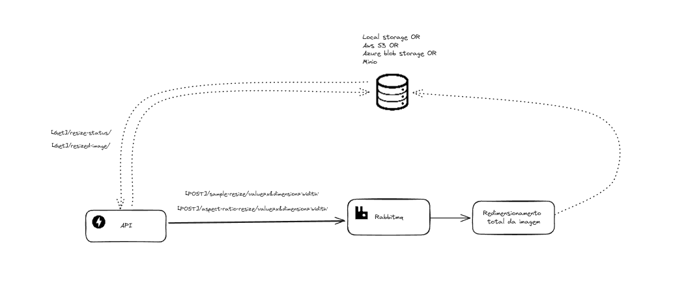

# kamesizer

Kamesizer é um redimensionador de imagem Via API.
<br>
# Como rodar a aplicação

Antes de rodar a aplicação precisamos garantir que as variáveis de ambiente estejam preenchdas, para tal, tanto no diretório /api quanto no diretório /rabbitmq, utilizer o arquivo .env.example como base e crie um arquivo .env nas duas pastas.

Apos ter configurado a aplicação vamos a execução, para tal, utilize docker (versão igual ou superior a 27.0.3) e, no diretório principal, rode o seguinte comando:

```sh
docker-compose up
```

assim que a aplicação subir, basta acessar localhost://0.0.0.0:8000/ para verificar o funcionamento.
<br>
# Funcionamento da aplicação

A aplicação consiste em uma API com 3 endpoints:
- **[POST]/image-resizer/resize?new_width={int}&new_height={int}**: Utilizando multipart-form e recebendo a nova largura (widith) e a nova altura(height) da imagem, esta rota foi desenvolvida para iniciar a criação de um redimensionamento, ele irá gerar um nome de arquivo, que deve ser utilizado nas demais rotas do sistema para verificar o status e resgatar a imagem.
- **[GET]/image-resizer/resize-status?file_name={str}**: Rota onde é possível, passando o nome gerado pela rota de resize, checar o status do redimensionamento na fila.
- **[POST]/image-resize/resized-image**: Rota que retorna a imagem, já redimensionada, assim que o processo é concluído.


<br>

> Para mais informações e teste da API, consulte a documentação swagger, acssando (localhost://0.0.0.0:8000/docs após rodar o projeto).

<br>
# Sobre a aplicação

A ideia da aplicação é de criar uma api que se comunique com uma fila e realize o redimensionamento de uma imagem. Com isso em mente imaginei a seguinte estrutura:

<br>
Nesta estrutra teremos o seguinte processo:


- A Api será responsável por coletar e validar a imagem que será passada para a fila, bem como salvar as informações da imagem no banco de dados da aplicação;
- A fila será responsável por delegar a funcionalidade que será executada para realizar o redimensionamento;
- Após feito o dimensionamento a fila será responsável por salvar a imagem redimensionada no storage utilizado na aplicação;
- Por fim, além de consultar o status relacionado ao redimensionamento, a API será responsável por recuperar a imagem redimensionada e entregar ao cliente solicitante.
